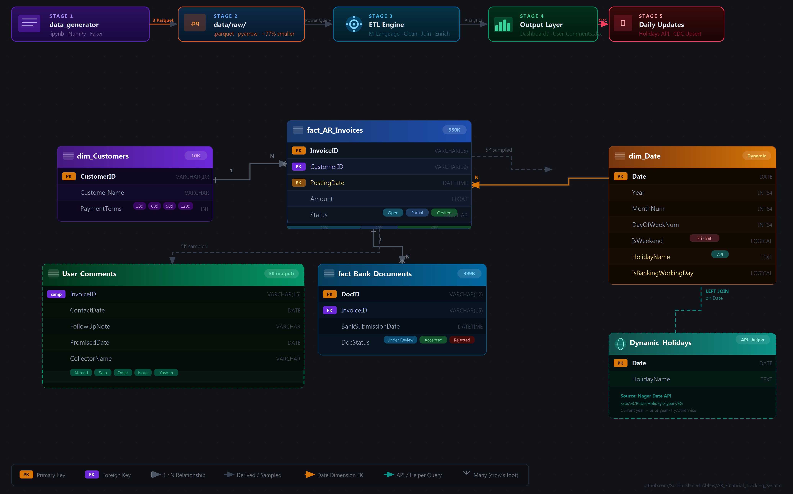

<div align="center">

# 📊 AR Financial Tracking System


<br/>

> **An end-to-end Accounts Receivable data engineering pipeline** — synthetic data generation at scale (950K+ records), Power Query ETL transformation, Star Schema modeling, and collection follow-up simulation — built for real-world AR analytics scenarios.

<br/>

---

</div>

## 📋 Table of Contents

- [🎯 Project Overview](#-project-overview)
- [🏗️ Architecture & Data Flow](#%EF%B8%8F-architecture--data-flow)
- [📐 Architecture Diagram](#-architecture-diagram)
- [📁 Repository Structure](#-repository-structure)
- [🗄️ Data Model — Star Schema](#%EF%B8%8F-data-model--star-schema)
- [📓 Notebooks](#-notebooks)
- [🔧 Scripts — Daily Updates & CDC](#-scripts--utility--daily-pipeline-scripts)
- [⚙️ ETL Engine](#%EF%B8%8F-etl-engine)
- [🗓️ Power Query Queries — dim\_Date & Dynamic\_Holidays](#%EF%B8%8F-power-query-queries--dim_date--dynamic_holidays)
- [⚡ Performance](#-performance)
- [🚀 Getting Started](#-getting-started)
- [📈 Key Metrics & KPIs](#-key-metrics--kpis)
- [🔍 Data Lineage](#-data-lineage)
- [🤝 Contributing](#-contributing)
- [📄 License](#-license)

---

## 🎯 Project Overview

The **AR Financial Tracking System** is a data engineering project that simulates and tracks an enterprise Accounts Receivable lifecycle — from synthetic invoice generation through ETL transformation to collection activity simulation.

The pipeline generates **950,000 invoices** across **10,000 customers** with realistic financial distributions, models them in a **Star Schema**, transforms them through **Power Query M-language**, and simulates **collection team follow-up activity** with human-like comments and promised payment dates.

### 🔑 What This System Does

| Layer | What Happens |
|-------|-------------|
| 🏗️ **Data Generation** | Vectorized synthetic dataset creation — 950K invoices, 10K customers, ~399K bank documents |
| 💾 **Parquet Storage** | All raw tables exported as Parquet via `pyarrow` — ~77 % smaller than CSV, schema-preserving |
| 🔄 **ETL Processing** | Power Query cleans, joins, and enriches raw Parquet files into an analytical data model |
| 📅 **Daily Updates (CDC)** | `daily_updates.py` fetches live EG holidays from API and applies Change Data Capture upserts to the master Parquet file |
| 🎭 **Activity Simulation** | Realistic AR collection follow-up notes, collector assignments, and promise-to-pay dates |
| 📊 **Star Schema** | Fact + Dimension tables structured for BI consumption |

---

## 🏗️ Architecture & Data Flow

The pipeline flows through five stages: **data generation → raw storage → ETL transformation → output layer → daily CDC updates**.

> See the [full architecture diagram](#-architecture-diagram) below for a visual overview including the Star Schema ERD.

```
 data_generator.ipynb  →  data/raw/  →  etl/Data_Model_Engine.xlsx
        ↓                   (.parquet)         ↓              ↓
  [NumPy · Faker]         [pyarrow]     [Dashboards]    [user_comments_generator.ipynb]
  950K invoices          ~77% smaller   [BI Layer]      [5K sampled follow-ups]
  10K customers                                           ↓
  ~399K bank docs                                   data/output/User_Comments.xlsx
```

---

## 📐 Architecture Diagram

<div align="center">



</div>

> [!TIP]
> High-resolution PNG (4140×2580 px). Open [`docs/diagram.svg`](docs/diagram.svg) for a fully zoomable vector version.

---

## 🔍 Data Lineage

Full column-level lineage — source generation logic, ETL transformations, KPI formulas, data contracts, and refresh order — is documented in [`docs/datalineage.md`](docs/datalineage.md).

---

## 📁 Repository Structure

```
AR_Financial_Tracking_System/
│
├── 📓 notebooks/
│   ├── data_generator.ipynb          # Stage 1: Synthetic data pipeline (950K records)
│   └── user_comments_generator.ipynb # Stage 2: AR follow-up activity simulation
│
├── 📂 data/
│   ├── raw/                          # Generated Parquet files (git-ignored)
│   │   ├── AR_Invoices_950K.parquet      # Fact table · 950,000 rows · ~13 MB 🔽 was ~58 MB CSV
│   │   ├── Customers_Master.parquet      # Customer dimension · 10,000 rows · ~0.2 MB
│   │   ├── Bank_Documents_Tracking.parquet # Bank submission tracking · ~399K rows · ~5 MB
│   │   └── Dynamic_Holidays.parquet      # Egyptian public holidays · written by daily_updates.py
│   ├── mappings/                     # Reference & dimension lookup tables
│   └── output/                       # Notebook exports (auto-created)
│       └── User_Comments.xlsx        # 5,000 simulated follow-up records
│
├── ⚙️  etl/
│   └── Data_Model_Engine.xlsx        # Power Query ETL workbook (~47 MB, git-ignored)
│
├── 📊 dashboards/                    # Dashboard files (coming soon)
│
├── 📁 docs/
│   ├── diagram.svg                   # Pipeline & ERD architecture diagram (vector)
│   ├── diagram.png                   # High-resolution PNG (4140×2580 px, 3× scale)
│   └── datalineage.md               # End-to-end column-level data lineage
│
├── 🔧 scripts/
│   ├── daily_updates.py              # Stage 5: Holidays API fetch + CDC upsert (run daily)
│   └── paths.py                      # Shared path configuration (OS-agnostic)
│
├── 📄 README.md
├── 📄 .gitignore
└── 📄 LICENSE
```

> [!NOTE]
> `data/raw/` files are excluded from Git via `.gitignore`. Run `data_generator.ipynb` to regenerate them locally in under 15 seconds. Parquet files (`*.parquet`) are also excluded globally.

---

## 🗄️ Data Model — Star Schema

```
  ┌──────────────────────────┐      ┌───────────────────────────────┐
  │      dim_Customers        │      │          dim_Date              │
  │──────────────────────────│      │───────────────────────────────│
  │  CustomerID  (PK)         │      │  Date            (PK)          │
  │  CustomerName             │      │  Year                          │
  │  PaymentTerms             │      │  MonthNum                      │
  │  (30 / 60 / 90 / 120 d)  │      │  DayOfWeekNum                  │
  └────────────┬─────────────┘      │  DayName                       │
               │ 1                  │  IsWeekend                     │
               │                    │  HolidayName                   │
               │ N                  │  IsBankingWorkingDay           │
  ┌────────────▼──────────────────────────────────────────────────┐  │
  │                    fact_AR_Invoices                            │  │
  │───────────────────────────────────────────────────────────────│  │
  │  InvoiceID    (PK)   INV-0000001 … INV-0950000                 │──┘
  │  CustomerID   (FK → dim_Customers)                             │  PostingDate
  │  PostingDate  (FK → dim_Date)                                  │
  │  Amount              $100 – $150,000                           │
  │  Status              Open · Partial · Cleared                  │
  └───────────────┬───────────────────────────────────────────────┘
                  │ 1
                  │
                  │ N (70% of Open/Partial)
  ┌───────────────▼───────────────────────────────────────────────┐
  │                  fact_Bank_Documents                           │
  │───────────────────────────────────────────────────────────────│
  │  DocID          (PK)   DOC-000001 …                            │
  │  InvoiceID      (FK → fact_AR_Invoices)                        │
  │  BankSubmissionDate                                            │
  │  DocStatus      Under Review · Accepted · Rejected (60/30/10%) │
  └───────────────────────────────────────────────────────────────┘

  (Helper query — not loaded to data model)
  ┌──────────────────────────┐
  │     Dynamic_Holidays      │
  │──────────────────────────│
  │  Date       (date)        │
  │  HolidayName (text)       │
  └────────────┬─────────────┘
               │ LEFT JOIN on Date
               ▼
           dim_Date
```

### Schema Statistics

| Table | Rows | Size | Role |
|-------|------|------|------|
| `fact_AR_Invoices` | 950,000 | ~58 MB | Core fact table |
| `dim_Customers` | 10,000 | ~295 KB | Customer dimension |
| `fact_Bank_Documents` | ~399,000 | ~24 MB | Bank tracking fact |
| `dim_Date` | ~730+ | — | Date dimension (Power Query) |
| `Dynamic_Holidays` | varies | — | API-sourced EG public holidays (helper) |
| `User_Comments` (output) | 5,000 | — | Follow-up simulation |

### Invoice Status Distribution

| Status | Probability | Description |
|--------|-------------|-------------|
| `Open` | 40% | Unpaid, awaiting collection |
| `Cleared` | 40% | Fully paid and settled |
| `Partial` | 20% | Partially paid, balance remaining |

---

## 📓 Notebooks

### 1️⃣ `data_generator.ipynb` — Synthetic Data Pipeline

Generates the entire dataset using **high-performance vectorized operations**.

**Pipeline steps:**

```
Install deps (pandas · numpy · faker · pyarrow)
        │
        ▼
[1] Environment Setup
    └─ Import libraries, start timer, init Faker
        │
        ▼
[2] Dimension Table — Customers (10,000 records)
    └─ Faker-generated company names
    └─ Random payment terms: 30 / 60 / 90 / 120 days
        │
        ▼
[3] Fact Table — AR Invoices (950,000 records)  ← NumPy vectorized
    └─ Invoice IDs: INV-0000001 to INV-0950000
    └─ Random posting dates over 730-day window
    └─ Invoice amounts: $100 – $150,000 (uniform)
    └─ Status: Open(40%) · Partial(20%) · Cleared(40%)
        │
        ▼
[4] Bank Documents Tracking (~399K records)
    └─ 70% of Open/Partial invoices submitted to bank
    └─ DocStatus: Under Review(60%) · Accepted(30%) · Rejected(10%)
        │
        ▼
[5] Export to Parquet → data/raw/
    └─ AR_Invoices_950K.parquet      (~13 MB — was ~58 MB CSV)
    └─ Customers_Master.parquet      (~0.2 MB)
    └─ Bank_Documents_Tracking.parquet (~5 MB — was ~24 MB CSV)
        │
        ▼
[6] Data Quality Assurance (DQA)
    └─ Record count validation
    └─ Referential integrity check (0 orphan invoices)
    └─ Statistical summary (describe)
```

**DQA Results (last run):**

| Check | Result |
|-------|--------|
| Invoices Count | ✅ 950,000 |
| Customers Count | ✅ 10,000 |
| Bank Documents | ✅ ~399,219 |
| Referential Integrity Issues | ✅ 0 |
| Execution Time | ✅ ~10.76 seconds |

---

### 2️⃣ `user_comments_generator.ipynb` — Collection Activity Simulation

Simulates realistic **AR collection team activity** by generating follow-up notes for open/partial invoices.

**Pipeline steps:**

```
[1] Load Data
    └─ Reads AR_Invoices_950K.parquet via pathlib (OS-agnostic)
    └─ Filters for Status ∈ {Open, Partial}
        │
        ▼
[2] Sampling
    └─ Randomly samples 5,000 invoices
    └─ Simulates realistic team workload
        │
        ▼
[3] Synthetic Comment Generation
    └─ Follow-up templates (4 types)
    └─ Promise-to-pay dates (1–14 days ahead)
    └─ Collector assignment (Ahmed · Sara · Omar · Nour)
        │
        ▼
[4] Export → data/output/User_Comments.xlsx
```

**Output schema:**

| Column | Description | Example |
|--------|-------------|---------|
| `InvoiceID` | Linked invoice | `INV-0123456` |
| `FollowUpNote` | Collector's comment | `"Customer promised to pay next Thursday"` |
| `PromisedDate` | Expected payment date | `2026-04-27` |
| `CollectorName` | Team member assigned | `Sara` |

**Follow-up note templates:**

```
• "Customer promised to pay next Thursday"
• "Waiting for manager approval"
• "Dispute over quantity, reviewing with sales"
• "Payment initiated, waiting for bank clearance"
```

---

### 🔧 `scripts/` — Utility & Daily Pipeline Scripts

#### `daily_updates.py` — Stage 5: Holidays API + CDC

A standalone script designed to be **run daily** (or on-demand). It keeps the master Parquet file and the holidays reference fresh without re-running the full data generator.

**Function 1: `update_holidays()`**

Fetches Egyptian public holidays from the [Nager Date API](https://date.nager.at) for the current and prior year. Saves the result as `data/raw/Dynamic_Holidays.parquet`.

```python
from scripts.daily_updates import update_holidays
update_holidays()  # → saves Dynamic_Holidays.parquet
```

**Function 2: `apply_cdc(daily_df)`**

Applies **Change Data Capture** upsert logic to the master invoice file. Uses `concat + drop_duplicates(keep='last')` — the daily delta always wins on existing keys, new keys are appended.

```
CDC Logic per run:
  ├─ 500 Open invoices  → Status updated to 'Cleared'
  ├─ 500 new INV-NEW-*  → Inserted as Status='Open'
  └─ Master: dedup(keep='last') → overwrite Parquet
```

**Net effect:** ~500 rows updated + ~500 rows inserted → master grows by ~500 rows/day net.

```bash
# Run from the project root
python scripts/daily_updates.py
```

#### `paths.py` — Shared Path Configuration

Eliminates hardcoded Windows backslash paths across all notebooks and scripts. Import once, use everywhere.

```python
from paths import RAW_DATA_DIR, OUTPUT_DIR, MAPPINGS_DIR

# Example usage
file_path = RAW_DATA_DIR / "AR_Invoices_950K.parquet"
output    = OUTPUT_DIR   / "User_Comments.xlsx"
```

---

## ⚙️ ETL Engine

**File:** `etl/Data_Model_Engine.xlsx` (~47 MB, **git-ignored** — too large for HTTPS push)

> [!NOTE]
> The ETL workbook is excluded from the repository due to its size. It is a locally-maintained Power Query file that reads from `data/raw/*.parquet`. The full M-language logic for all queries is documented here in the README and in [`docs/datalineage.md`](docs/datalineage.md).

The Power Query ETL workbook connects to the raw **Parquet files** and applies the full transformation pipeline:

| Step | Operation |
|------|-----------|
| 1️⃣ | Load all three raw **Parquet** files (`AR_Invoices_950K`, `Customers_Master`, `Bank_Documents_Tracking`) |
| 2️⃣ | Clean data types (dates, decimals, IDs) |
| 3️⃣ | Join `fact_AR_Invoices` ↔ `dim_Customers` |
| 4️⃣ | Calculate **aging buckets** (0–30 / 31–60 / 61–90 / 90+ days) |
| 5️⃣ | Compute **Days Outstanding** per invoice |
| 6️⃣ | Flag overdue invoices for collections |
| 7️⃣ | Join bank document status |
| 8️⃣ | **Fetch Egyptian public holidays** via `Dynamic_Holidays` (Nager Date API) |
| 9️⃣ | **Build `dim_Date`** — calendar table with weekend & banking working day flags |
| 🔟 | Output analytical model for dashboard consumption |

> [!TIP]
> To refresh: open `Data_Model_Engine.xlsx` → **Data tab** → **Refresh All**. Ensure the Parquet files are present in `data/raw/` first (regenerate by running `data_generator.ipynb`).

---

## 🗓️ Power Query Queries — dim\_Date & Dynamic\_Holidays

Two Power Query M-language queries extend the ETL workbook with a **fully dynamic date dimension** and **live-fetched Egyptian public holidays**.

### `Dynamic_Holidays` — Live Holiday API Feed

Fetches Egyptian public holidays for the current and prior year from the [Nager Date API](https://date.nager.at) (`/api/v3/PublicHolidays/{year}/EG`). The query is fault-tolerant — if the API is unreachable, affected years return `null` and are silently dropped.

**Output columns:** `Date` (date) · `HolidayName` (text)

```powerquery
let
    // 1. Define the date range (current year + previous year for historical data coverage)
    CurrentYear = Date.Year(DateTime.LocalNow()),
    YearsList = {CurrentYear - 1, CurrentYear},

    // 2. Build a dynamic function to call the API for each year separately
    //    Country code "EG" fetches Egypt-specific public holidays
    GetHolidays = (Year as number) =>
        let
            ApiUrl = "https://date.nager.at/api/v3/PublicHolidays/" & Text.From(Year) & "/EG",
            // Use try...otherwise to prevent query failure if the API is unreachable
            Source = try Json.Document(Web.Contents(ApiUrl)) otherwise null
        in
            Source,

    // 3. Execute the function against the list of years
    FetchData = List.Transform(YearsList, each GetHolidays(_)),

    // 4. Remove any null responses (failed requests)
    RemoveNulls = List.RemoveNulls(FetchData),

    // 5. Combine the fetched lists into one
    CombinedList = List.Combine(RemoveNulls),

    // 6. Convert the combined list to a readable table
    ConvertedToTable = Table.FromList(CombinedList, Splitter.SplitByNothing(), null, null, ExtraValues.Error),

    // 7. Extract only the date and holiday name columns; discard unnecessary data
    ExpandedColumn = Table.ExpandRecordColumn(ConvertedToTable, "Column1", {"date", "name"}, {"Date", "HolidayName"}),

    // 8. Set correct data types to ensure successful Join with Dim_Calendar
    ChangedType = Table.TransformColumnTypes(ExpandedColumn,{{"Date", type date}, {"HolidayName", type text}})
in
    ChangedType
```

---

### `dim_Date` — Dynamic Calendar Dimension

Builds a **date dimension table** whose boundaries are derived dynamically from `Fact_AR_Invoices[PostingDate]` — no hardcoded dates. Integrates `Dynamic_Holidays` via a Left Outer Join to populate `HolidayName`, then derives `IsBankingWorkingDay` (excludes weekends **and** public holidays). Egyptian weekend convention (Friday = day 5, Saturday = day 6) is applied.

**Output columns:** `Date` · `Year` · `MonthNum` · `DayOfWeekNum` · `DayName` · `IsWeekend` · `HolidayName` · `IsBankingWorkingDay`

```powerquery
let
    // 1. Performance Optimization: Buffer the date column to prevent multiple disk scans
    BufferedDates = List.Buffer(Fact_AR_Invoices[PostingDate]),

    // 2. Extract boundaries safely
    MinFactDate = List.Min(BufferedDates),
    MaxFactDate = List.Max(BufferedDates),

    // 3. Logic Correction: Force boundaries to full years for DAX compatibility
    StartDate = #date(Date.Year(MinFactDate), 1, 1),
    EndDate   = #date(Date.Year(MaxFactDate), 12, 31),
    DayCount  = Duration.Days(Duration.From(EndDate - StartDate)) + 1,

    // 4. Generate Base Calendar
    SourceList    = List.Dates(StartDate, DayCount, #duration(1, 0, 0, 0)),
    TableFromList = Table.FromList(SourceList, Splitter.SplitByNothing(), {"Date"}, null, ExtraValues.Error),
    CalendarBase  = Table.TransformColumnTypes(TableFromList,{{"Date", type date}}),

    // 5. Build Dimensions
    InsertYear         = Table.AddColumn(CalendarBase,    "Year",         each Date.Year([Date]),                       Int64.Type),
    InsertMonthNum     = Table.AddColumn(InsertYear,      "MonthNum",     each Date.Month([Date]),                      Int64.Type),
    InsertDayOfWeekNum = Table.AddColumn(InsertMonthNum,  "DayOfWeekNum", each Date.DayOfWeek([Date], Day.Sunday),      Int64.Type),
    InsertDayName      = Table.AddColumn(InsertDayOfWeekNum, "DayName",   each Date.DayOfWeekName([Date], "en-US"),     type text),

    // 6. Static Weekend Logic (Friday = 5, Saturday = 6 in Egyptian banking calendar)
    InsertIsWeekend = Table.AddColumn(InsertDayName, "IsWeekend", each
        if [DayOfWeekNum] = 5 or [DayOfWeekNum] = 6 then true else false, type logical),

    // 7. Dynamic Holiday Integration via Left Outer Join
    MergeHolidays  = Table.NestedJoin(InsertIsWeekend, {"Date"}, Dynamic_Holidays, {"Date"}, "HolidayData", JoinKind.LeftOuter),
    ExpandHolidays = Table.ExpandTableColumn(MergeHolidays, "HolidayData", {"HolidayName"}, {"HolidayName"}),

    // 8. Final Banking Working Day Calculation
    InsertIsWorkingDay = Table.AddColumn(ExpandHolidays, "IsBankingWorkingDay", each
        if [IsWeekend] = true or [HolidayName] <> null then false else true, type logical),

    // 9. Replace nulls in HolidayName with descriptive labels
    ReplaceNullHolidays = Table.ReplaceValue(
        InsertIsWorkingDay,
        null,
        each if [IsWeekend] = true then "Weekend" else "Working Day",
        Replacer.ReplaceValue,
        {"HolidayName"}
    ),
    #"Changed Type" = Table.TransformColumnTypes(ReplaceNullHolidays,{{"HolidayName", type text}})
in
    #"Changed Type"
```

> [!NOTE]
> `Dynamic_Holidays` is a **connection-only** helper query — it is not loaded to the data model. `dim_Date` loads to the model and joins to `fact_AR_Invoices` on `PostingDate`.

---

## ⚡ Performance

The data generation pipeline is built for **high throughput** using vectorized NumPy operations instead of row-by-row loops:

| Technique | Benefit |
|-----------|---------|
| `np.random.choice` / `np.random.uniform` | Generates millions of values in milliseconds |
| `pd.to_timedelta` vectorized date arithmetic | No Python-level date loops |
| Faker used only for small dimension tables | Avoids slow iteration on large volumes |
| Single-pass DataFrame construction | Minimizes memory allocations |

**Benchmark:** 950,000 invoices + 10,000 customers + ~399,000 bank docs generated and exported in **~10.76 seconds** on a standard laptop.

---

## 🚀 Getting Started

### Prerequisites

```bash
python --version      # 3.8+ required (tested on 3.13.1)
pip install pandas numpy faker openpyxl pyarrow requests
```

### Step 1 — Clone

```bash
git clone https://github.com/Sohila-Khaled-Abbas/AR_Financial_Tracking_System.git
cd AR_Financial_Tracking_System
```

### Step 2 — Generate the Raw Data

This creates three **Parquet files** in `data/raw/`:
```
data/raw/AR_Invoices_950K.parquet          (~13 MB  ← was ~58 MB as CSV)
data/raw/Customers_Master.parquet          (~0.2 MB ← was ~295 KB as CSV)
data/raw/Bank_Documents_Tracking.parquet   (~5 MB   ← was ~24 MB as CSV)
```

### Step 3 — Run the ETL

Open `etl/Data_Model_Engine.xlsx` and click **Data → Refresh All**.

### Step 4 — Simulate Collection Activity

Run `notebooks/user_comments_generator.ipynb`.

Output: `data/output/User_Comments.xlsx`

### Step 5 — Run Daily Updates (CDC)

```bash
python scripts/daily_updates.py
```

This does two things in sequence:
- Fetches live Egyptian public holidays → saves `data/raw/Dynamic_Holidays.parquet`
- Applies CDC upsert → updates 500 Open invoices to Cleared, inserts 500 new invoices into the master Parquet file

### Step 6 — Explore Dashboards

Open files in the `dashboards/` folder (coming soon).

> [!IMPORTANT]
> `data/raw/` is in `.gitignore` — Parquet files are never committed. Always regenerate locally using `data_generator.ipynb`. Generation takes ~11 seconds; Parquet files are ~77% smaller than the equivalent CSVs.

---

## 📈 Key Metrics & KPIs

### Aging Bucket Analysis

```
Invoice Age          Volume           Action
─────────────────────────────────────────────────────────────
0  – 30  days   │████████████████│  Monitor
31 – 60  days   │████████████    │  Soft follow-up
61 – 90  days   │████████        │  Escalate to collector
90+      days   │████            │  ⚠️ Legal / write-off risk
```

### Key KPIs Tracked

| KPI | Formula |
|-----|---------|
| **Total AR Outstanding** | `SUM(Amount WHERE Status IN (Open, Partial))` |
| **Days Sales Outstanding (DSO)** | `(AR Balance / Credit Sales) × Days in Period` |
| **Collection Rate** | `Cleared / (Cleared + Open + Partial) × 100` |
| **Bank Acceptance Rate** | `Accepted / Total Bank Docs × 100` |
| **Overdue Rate** | `Invoices > 60 days / Total Open × 100` |

---

## 🤝 Contributing

1. **Fork** the repository
2. **Create** a feature branch: `git checkout -b feature/your-feature`
3. **Commit** using conventional commits: `git commit -m "feat: add aging bucket logic"`
4. **Push**: `git push origin feature/your-feature`
5. **Open** a Pull Request

### Commit Convention

| Prefix | Use Case |
|--------|----------|
| `feat:` | New notebook, ETL step, or pipeline stage |
| `fix:` | Bug fix in data logic |
| `data:` | Schema or column changes |
| `docs:` | README or docstring updates |
| `refactor:` | Code cleanup without behavior change |
| `perf:` | Performance improvements |

---

## 📄 License

This project is licensed under the **MIT License** — see [LICENSE](LICENSE) for details.

---

<div align="center">

Built with ❤️ by [Sohila Khaled Abbas](https://github.com/Sohila-Khaled-Abbas)

**[⬆ Back to Top](#-ar-financial-tracking-system)**

</div>
